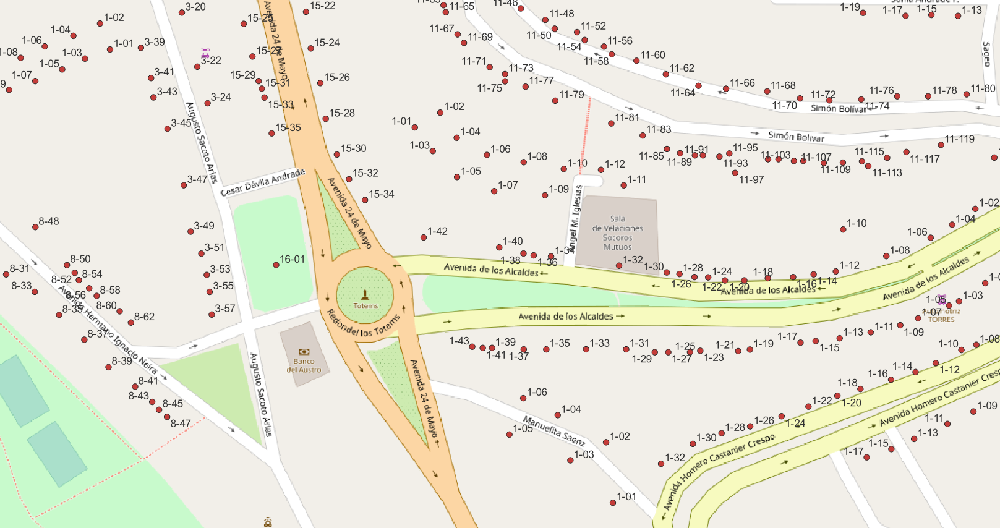

<aside>
<table align="right" style="padding: 1em">
<tr><td>Paquete <a target="_git" title="Enlace canónico a git para este paquete." href="https://git.digital-guard.org/preserv-EC/blob/main/data/F/Azogues/_pk0001.01"><big><b>pk0001.01</b></big></a> de <small><a target="_afacodes" title="Jurisdicción" href="https://afa.codes/EC-F-Azogues">EC-F-Azogues</a></small>
</td></tr>
<tr><td>
Donante: <a rel="external" target="_doador" href="https://www.azogues.gob.ec">San Francisco de Peleusí de Azogues</a>
 &nbsp; <small>- </small> • Wikidata <a rel="external" target="_doador" title="Enlace del descriptor Wikidata del donante" href="https://www.wikidata.org/wiki/Q786758">Q786758</a></small> 

Obtido via <i>email</i> em <b>15/03/2022</b> por:
 &nbsp; Avaliação técnica: <a rel="external" target="_gitPerson" title="Usuario de Git" href="https://github.com/crebollobr">crebollobr</a>
 &nbsp; Representação institucional: <a rel="external" target="_gitPerson" title="Usuario de" href="https://github.com/ThierryAJean">ThierryAJean</a> 
</td></tr>
<tr><td>Camadas:  </td></tr>
<tr><td>Datos publicados en <a href="https://git.digital-guard.org/preservCutGeo-EC2021/tree/main/data/F/Azogues/_pk0001.01">preservCutGeo-EC2021</a> <a href="#reproducibilidad">Reproducible</a></td></tr>
<tr><td>Visualización:  </td></tr>
</table>
</aside>

<section>

Este repositorio de metadatos describe un paquete de archivos donados al dominio público. Está siendo conservado por Digital Guard: para obtener más detalles, consulte la [documentación sobre el proceso de registro y conservación](https://wiki.addressforall.org/doc/Documentação_Digital-guard).

Nota. Este documento README fue generado por software a partir de la información contenida en el archivo [`make_conf.yaml`](https://git.digital-guard.org/preserv-EC/blob/main/data/F/Azogues/_pk0001.01/make_conf.yaml) en este paquete, e información adicional de los catálogos de [donantes](https://git.digital-guard.org/preserv-BR/blob/main/data/donor.csv) y [paquetes](https://git.digital-guard.org/preserv-BR/blob/main/data/donatedPack.csv).

# Capas de datos

Los archivos contienen "capas de datos" temáticas. Los metadatos también describen cómo se evaluó cada capa y cómo se filtraron sus datos de forma estandarizada.

##  geoaddress

Nombre del archivo: `numeracion_casas_direccion/numeracion_casas_t_direcc` *Descarga* e integridad: [77329f34a71ed1dcf470ac74a96b5a93ee27245060b5980a1153a6bd81e2e7ea.zip](http://dl.digital-guard.org/77329f34a71ed1dcf470ac74a96b5a93ee27245060b5980a1153a6bd81e2e7ea.zip) Descripción: Endereços Tamaño del archivo: 6886017 bytes (6.57 <abbr title="mebibyte">MiB</abbr>) Formato: shp SRID: 32717

#### Datos relevantes
* `numero` (hnum)

* `calle` (via)

#### Filtrado de resultados y su publicación
249113 bytes (0.24 <abbr title="mebibyte">MiB</abbr>) 4720 pontos densidad media: 210.72 pontos/km² GeoJSONs publicados em [https://git.digital-guard.org/preservCutGeo-EC2021/tree/main/data/F/Azogues/_pk0001.01/geoaddress](https://git.digital-guard.org/preservCutGeo-EC2021/tree/main/data/F/Azogues/_pk0001.01/geoaddress)

#### Visualización
[https://viz.addressforall.org/EC-F-Azogues/_pk0001.01/geoaddress](https://viz.addressforall.org/EC-F-Azogues/_pk0001.01/geoaddress)

# Evidencia de prueba

</section>
<section>

# Reproducibilidad

Consulte los detalles en [reproducibility.sh](https://git.digital-guard.org/preserv-EC/blob/main/data/F/Azogues/_pk0001.01/reproducibility.sh).

</section>

